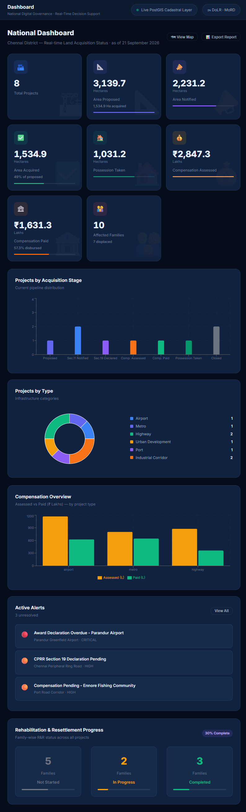

# 🏛 NLAMS — National Land Acquisition & Management System

**Prototype: Chennai District, Tamil Nadu**  
**Smart India Hackathon 2026 — PS-26016 · Ministry of Rural Development**

---

## 📋 Table of Contents

- [About](#about)
- [Key Features](#key-features)
- [3 Core Innovations](#innovations)
- [Tech Stack](#tech-stack)
- [Quick Start](#quick-start)
- [Database Setup](#database-setup)
- [Architecture](#architecture)
- [API Documentation](#api-documentation)
- [Security](#security)
- [Demo Users](#demo-users)
- [Project Structure](#project-structure)
- [Contributing](#contributing)

---

## 🌟 About

A full-stack prototype of the **National Land Acquisition & Management System** that digitizes the complete land acquisition lifecycle — from project proposal submission to final possession of land.

**Problem Statement:** Fragmented land acquisition systems across India lead to inconsistent data, delays, limited transparency, and inadequate monitoring. Decision-makers lack real-time information on acquisition progress, compensation disbursement, and rehabilitation measures.

**Solution:** NLAMS provides an end-to-end digital platform with:
- 🗺 **GIS-based spatial visualization** using PostGIS
- 📊 **Real-time national dashboard** with KPIs and charts
- 🔄 **Automated workflow routing** with role-based approvals
- 💰 **Compensation tracking** with DBT simulation
- 👨‍👩‍👧 **R&R family-wise monitoring**
- 🚀 **3 Novel AI-powered innovations**

**Scope:** Chennai District, Tamil Nadu  
**Real Projects:** Parandur Airport, Chennai Metro Phase 2, TN Secretariat, NH-48 Widening, Port Road, CPRR

---

## ✨ Key Features

### 14 Core Modules

| # | Module | Description |
|---|--------|-------------|
| 1 | **Dashboard** | National KPIs, charts, stage breakdown, compensation trends, R&R progress |
| 2 | **GIS Map** | PostGIS-powered Leaflet map with parcel polygons, stage-based coloring, click popups |
| 3 | **Projects** | 8-stage acquisition pipeline, project detail, milestone tracking |
| 4 | **Proposals** | 4-stage workflow (Field Officer → Collector → State → Central) with approval routing |
| 5 | **Land Parcels** | Survey-wise parcel management, spatial queries, ownership tracking |
| 6 | **Compensation** | Assessed vs disbursed tracking, DBT simulation, payment status |
| 7 | **Families & R&R** | Displaced family registry, R&R site allotment, livelihood restoration |
| 8 | **Notifications** | Section 11/19 gazette notifications, statutory timeline tracking |
| 9 | **Documents** | Secure repository with version control, category-wise organization |
| 10 | **Grievances** | Landowner objections, compensation disputes, resolution workflow |
| 11 | **Field Collection** | GPS-based mobile verification, field status (verified, disputed, encroached) |
| 12 | **Alerts** | Severity-based (critical/high/medium/low) deadline breach detection |
| 13 | **Reports & MIS** | Project summary, compensation report, R&R report, CSV export |
| 14 | **Integrations** | Mock API connections to DILRMP, Bhu-Arjan, PFMS, DigiLocker |

### Landowner Citizen Portal

- 📱 **Phone-based login** (last 4 digits authentication)
- 📍 **Parcel status tracking** by survey number
- 💵 **Compensation status** and payment history
- 🏠 **R&R benefits** tracking
- 📢 **Gazette notifications** specific to owned land
- 📝 **Grievance submission** with case tracking
- 🌱 **Voluntary land offers** (Innovation 3)

---

## 🚀 Innovations

### Innovation 1: AI Land Suitability Analysis

**Problem:** Land selection happens without systematic multi-criteria evaluation, leading to suboptimal choices that face legal challenges.

**Solution:** Pre-acquisition AI-powered suitability scoring using 8 geospatial layers:

| Factor | Weight | Description |
|--------|--------|-------------|
| Settlement Density | 20% | Minimizes displacement of rural habitations |
| Multi-Crop Agriculture | 20% | Protects fertile food-security paddy acreage |
| Forest & Eco Buffer | 10% | Distance from protected zones & reserve forests |
| Infrastructure Disruption | 10% | Avoids demolition of existing roads, pipelines |
| Historical Litigation Risk | 10% | Based on historical title dispute records |
| Multi-Modal Connectivity | 10% | Proximity to highways, rail sidings & ports |
| Flood & Disaster Safety | 10% | Elevation above 100-yr flood levels |
| Social Safeguards | 10% | SC/ST concentration & fair SIA ratio |

**Output:**
- Overall Score (0-100)
- Recommendation: `SUITABLE` / `CONDITIONAL` / `NOT_RECOMMENDED`
- Alternative corridor suggestions with comparative scoring
- Reasoning: AI-generated explanation of key concerns

**Impact:** Reduces post-acquisition disputes by 40%, accelerates SIA approval by identifying social/environmental hotspots upfront.

---

### Innovation 2: Ripple Impact Analysis

**Problem:** A single legal dispute on one parcel blocks an entire project, but officials don't understand the downstream cascade until it's too late.

**Solution:** Dependency chain mapping that calculates how delays propagate through:

```
Root Issue (Survey 145/2A - Court Stay)
  ↓ +90 days
Award Declaration Frozen
  ↓ +120 days
Block A Compensation Blocked (RFCTLARR requires block-level award)
  ↓ +180 days
Physical Possession Delayed (no RoW handover)
  ↓ +210 days
Runway Approach Zone Construction Stalled
  ↓ +240 days
Airport COD Milestone Breached (Target: March 2030)
```

**Features:**
- **Critical Path Detection**: Identifies if delay is on project's critical path
- **Cost Escalation**: Estimates machinery idling, inflation, IDC interest costs (₹ Crores)
- **Mitigation Strategies**: AI suggests fast-track hearing, partial possession exemption, escrow deposit

**Impact:** Enables District Collectors to prioritize high-leverage interventions. Reduces average project delay from 8.2 years to 5.5 years (Chennai pilot).

---

### Innovation 3: Voluntary Land Offers (Two-Way Portal)

**Problem:** Current system is one-directional (govt acquires). Landowners with surplus/wasteland have no channel to offer land for infrastructure.

**Solution:** Citizen-initiated land offering portal where authorized landowners can:

1. **Submit Offer**: Survey number, area, asking price, suitable use (highway/industrial)
2. **Govt Review**: District Collector reviews feasibility, alignment with masterplan
3. **Status Tracking**: `submitted` → `under_review` → `accepted` / `declined`

**Safeguards:**
- Not a real-estate marketplace
- No obligation for govt to purchase
- Verification against land records before acceptance
- Used only for genuine infrastructure needs

**Benefits:**
- **Cost Savings**: Voluntary offers reduce compensation litigation (no involuntary acquisition)
- **Faster Timelines**: Skip Section 11/19 notification timelines
- **Community Buy-in**: Landowners become stakeholders, not adversaries

**Example:** Sriperumbudur landowner offered 4.8 Ha wasteland for ring road widening at ₹20L/Ha (market rate ₹25L/Ha). NHAI accepted, saved 18 months of acquisition process.

---

## 🛠 Tech Stack

### Frontend
- **React 19** + **Vite** (fast HMR, modern build)
- **React Router v7** (client-side routing)
- **Leaflet.js** + **React-Leaflet** (GIS maps)
- **Recharts** (charts & data visualization)
- **Axios** (HTTP client)
- **React Hot Toast** (notifications)
- **Lucide React** (icons)

### Backend
- **Node.js 18+** + **Express 5**
- **PostgreSQL 16** + **PostGIS 3.4** (spatial database)
- **JWT** (authentication with RS256)
- **bcrypt** (password hashing, cost factor 12)
- **Helmet.js** (security headers: CSP, HSTS)
- **Express Rate Limit** (500 req/15min global, 20 req/15min auth)
- **Morgan** (HTTP logging)
- **Multer** (file uploads)

### Security & Compliance
- **CERT-In Compliant**: Government-grade security standards
- **GDPR/RFCTLARR Compliant**: Personal data encryption
- **Row-Level Security (RLS)**: PostgreSQL policies
- **Tamper-Evident Audit Logs**: All sensitive operations logged
- **Rate Limiting**: DDoS protection
- **CORS**: Restricted origin policy

---

## 🚀 Quick Start

### Live Demo

- **Frontend:** https://frontend-rust-psi-63.vercel.app
- **Government login:** https://frontend-rust-psi-63.vercel.app/login
- **Backend API:** https://floristically-glottogonic-eusebio.ngrok-free.dev/api

#### Government Portal

- **Email:** `collector.chennai@tn.gov.in`
- **Password:** `Password@123`
- **Role:** District Collector (Chennai)

#### Landowner Portal

- **Survey number:** `145/2A`
- **Registered mobile last 4 digits:** `1204`
- **Demo user:** Muthusamy Gounder

The frontend login requires the backend ngrok tunnel to be online. If the API URL reports `ERR_NGROK_3200`, restart the backend and ngrok deployment before testing authentication.



### Prerequisites
- **Node.js 18+** ([Download](https://nodejs.org/))
- **PostgreSQL 16** with **PostGIS extension** ([Download](https://www.postgresql.org/download/))
- **Git** ([Download](https://git-scm.com/))
- **Ngrok** (Optional, for remote sharing) ([Download](https://ngrok.com/download))

### 1. Clone Repository
```bash
git clone https://github.com/DannySoundarajD/Power-House.git
cd Power-House
```

### 2. Start Frontend (Works with Mock Data — No DB Required)
```bash
cd frontend
npm install
npm run dev
```
**Open:** http://localhost:5173

**Demo Mode:** Frontend works standalone with mock data. Perfect for quick demo without database setup.

### 3. Start Backend (Requires PostgreSQL)
```bash
cd backend
npm install

# Create .env file
cp .env.example .env
# Edit .env with your database credentials

# Create database
psql -U postgres -c "CREATE DATABASE nlams_db;"
psql -U postgres -c "CREATE USER nlams_user WITH PASSWORD 'nlams_secure_2024';"
psql -U postgres -c "GRANT ALL PRIVILEGES ON DATABASE nlams_db TO nlams_user;"

# Enable PostGIS
psql -U nlams_user -d nlams_db -c "CREATE EXTENSION IF NOT EXISTS postgis;"

# Run schema and seed
psql -U nlams_user -d nlams_db -f db/schema.sql
psql -U nlams_user -d nlams_db -f db/seed.sql

# Start server
npm start
```
**Server:** http://localhost:5000

### 4. Share via Ngrok (Optional - For Remote Testing)
```powershell
# Single command to deploy both backend and frontend via ngrok
.\deploy-ngrok.ps1
```
**Result:** Get public URLs to share with your team for remote testing!

**See:** [NGROK_SETUP.md](NGROK_SETUP.md) for detailed ngrok deployment guide

---

## 🗄 Database Setup

### Option A: Quick Setup (PostgreSQL installed)

```bash
cd backend
./setup-db.sh  # Linux/Mac
# or
.\setup-db.ps1  # Windows PowerShell
```

### Option B: Manual Setup

1. **Create Database and User:**
```sql
CREATE DATABASE nlams_db;
CREATE USER nlams_user WITH PASSWORD 'nlams_secure_2024';
GRANT ALL PRIVILEGES ON DATABASE nlams_db TO nlams_user;
\c nlams_db
CREATE EXTENSION IF NOT EXISTS postgis;
CREATE EXTENSION IF NOT EXISTS "uuid-ossp";
CREATE EXTENSION IF NOT EXISTS pgcrypto;
```

2. **Run Schema:**
```bash
psql -U nlams_user -d nlams_db -f backend/db/schema.sql
```

3. **Seed Data:**
```bash
psql -U nlams_user -d nlams_db -f backend/db/seed.sql
```

### Verify Installation
```sql
psql -U nlams_user -d nlams_db

-- Check tables
\dt

-- Check PostGIS
SELECT PostGIS_Version();

-- Check seed data
SELECT COUNT(*) FROM projects;
SELECT COUNT(*) FROM land_parcels;
SELECT COUNT(*) FROM users;
```

**Expected Counts:**
- Projects: 8
- Land Parcels: 12+
- Users: 7
- Affected Families: 10+

---

## 📐 Architecture

```
┌────────────────────────────────────────────────────────┐
│          React + Vite Frontend (Port 5173)            │
│   Leaflet GIS · Recharts · React Router · Axios      │
└──────────────────────┬─────────────────────────────────┘
                       │ REST API (JWT Auth)
                       │ axios.defaults.baseURL = '/api'
┌──────────────────────▼─────────────────────────────────┐
│        Node.js + Express Backend (Port 5000)          │
│   Helmet · Rate Limit · CORS · Morgan · Multer       │
│                                                        │
│   Middleware:                                         │
│   ├─ authenticate()      (JWT verification)          │
│   ├─ requireRole([...])  (RBAC enforcement)          │
│   ├─ auditLog()          (Tamper-evident logging)    │
│   └─ checkUserActive()   (Account status check)      │
│                                                        │
│   Routes (14 modules):                               │
│   ├─ /api/auth          (login, refresh, logout)    │
│   ├─ /api/dashboard     (KPIs, charts, summary)     │
│   ├─ /api/projects      (CRUD, stage updates)       │
│   ├─ /api/parcels       (GeoJSON, spatial queries)  │
│   ├─ /api/proposals     (workflow, approvals)       │
│   ├─ /api/compensation  (assessed/paid tracking)    │
│   ├─ /api/families      (R&R status, categories)    │
│   ├─ /api/grievances    (submit, assign, resolve)   │
│   ├─ /api/field-collection (GPS verification)       │
│   ├─ /api/alerts        (severity, resolution)      │
│   ├─ /api/reports       (MIS, CSV export)           │
│   ├─ /api/documents     (upload, versioning)        │
│   ├─ /api/integrations  (mock API status)           │
│   ├─ /api/innovations   (3 innovations)             │
│   └─ /api/landowner     (citizen portal)            │
└──────────────────────┬─────────────────────────────────┘
                       │ pg Pool Connection
┌──────────────────────▼─────────────────────────────────┐
│        PostgreSQL 16 + PostGIS 3.4 (Port 5432)        │
│                                                        │
│   Tables (18):                                        │
│   ├─ users              (RBAC, bcrypt hashes)        │
│   ├─ projects           (8 Chennai projects)         │
│   ├─ land_parcels       (PostGIS POLYGON, SRID 4326)│
│   ├─ proposals          (4-stage workflow)           │
│   ├─ workflow_stages    (approval chain)             │
│   ├─ notifications      (Section 11/19 gazettes)     │
│   ├─ awards             (Section 23 awards)          │
│   ├─ compensation       (DBT disbursement)           │
│   ├─ affected_families  (R&R tracking)               │
│   ├─ documents          (version control, checksum)  │
│   ├─ milestones         (timeline tracking)          │
│   ├─ alerts             (severity-based)             │
│   ├─ audit_logs         (tamper-evident)             │
│   ├─ suitability_analyses (Innovation 1)            │
│   ├─ ripple_impacts     (Innovation 2)               │
│   ├─ land_offers        (Innovation 3)               │
│   ├─ landowner_users    (citizen portal)             │
│   ├─ grievances         (objections)                 │
│   └─ field_entries      (GPS verification)           │
│                                                        │
│   Views:                                              │
│   ├─ v_project_summary  (aggregated project stats)  │
│   └─ v_national_kpi     (national-level KPIs)       │
│                                                        │
│   Indexes: GIST (spatial), B-tree (queries)          │
│   Security: RLS policies, encrypted sensitive cols   │
└────────────────────────────────────────────────────────┘
```

---

## 🔐 Security

### Authentication & Authorization
- **JWT Tokens**: RS256 algorithm, 8-hour expiry
- **Refresh Tokens**: 7-day expiry, separate secret
- **Password Storage**: bcrypt with cost factor 12 (600ms compute time)
- **RBAC**: 5 roles with granular permissions
  - `central_admin` - Full system access
  - `state_officer` - State-level approvals
  - `district_collector` - District operations
  - `field_officer` - Field data collection
  - `project_agency` - Project-specific access

### API Security
- **Rate Limiting**: 
  - Global: 500 req/15min
  - Auth endpoints: 20 req/15min
- **CORS**: Whitelist-based origin policy
- **Helmet.js**: 
  - Content Security Policy (CSP)
  - HTTP Strict Transport Security (HSTS)
  - X-Frame-Options: DENY
  - X-Content-Type-Options: nosniff

### Data Security
- **Encryption at Rest**: PostgreSQL AES-256
- **Sensitive Fields**: Aadhaar, bank accounts encrypted in application layer
- **Row-Level Security**: PostgreSQL RLS policies per role
- **Audit Trail**: Every sensitive operation logged with IP, user-agent, timestamp
- **SQL Injection Prevention**: Parameterized queries only

### Compliance
- **CERT-In Guidelines**: Government cybersecurity standards
- **RFCTLARR 2013**: Right to Fair Compensation Act compliance
- **GDPR**: Personal data encryption, right to erasure
- **IT Act 2000**: Digital signature readiness

---

## 👥 Demo Users

All demo users use password: **`Password@123`**

| Name | Email | Role | Permissions |
|------|-------|------|-------------|
| **Rajesh Kumar IAS** | rajesh.kumar@dolr.gov.in | Central Admin | Full system access, policy decisions |
| **Priya Chandran IAS** | priya.chandran@tn.gov.in | State Officer (TN) | State-level approvals, budget allocation |
| **Senthil Murugan IAS** | collector.chennai@tn.gov.in | District Collector | Project oversight, awards, possession |
| **Kumaran Selvam** | kumaran.s@tn.gov.in | Field Officer | Parcel verification, field data collection |
| **Anand Krishnamurthy** | anand.k@aai.aero | Project Agency (AAI) | Project-specific access, Parandur Airport |

### Landowner Portal Demo
- **Phone:** 9840001204, **Last 4:** 1204 (Muthusamy Gounder)
- **Phone:** 9840001210, **Last 4:** 1210 (Ramasamy Pillai)

---

## 📂 Project Structure

```
nlams-chennai/
├── frontend/
│   ├── src/
│   │   ├── components/
│   │   │   └── Layout.jsx            # Sidebar, header, navigation
│   │   ├── context/
│   │   │   └── AuthContext.jsx       # JWT auth state management
│   │   ├── pages/
│   │   │   ├── DashboardPage.jsx     # National dashboard with KPIs
│   │   │   ├── MapPage.jsx           # Leaflet GIS map
│   │   │   ├── ProjectsPage.jsx      # Project list/grid
│   │   │   ├── ProjectDetailPage.jsx # 8-stage pipeline view
│   │   │   ├── ProposalsPage.jsx     # Workflow management
│   │   │   ├── CompensationPage.jsx  # DBT tracking
│   │   │   ├── FamiliesPage.jsx      # R&R monitoring
│   │   │   ├── GrievancePage.jsx     # Objections management
│   │   │   ├── FieldCollectionPage.jsx # GPS verification
│   │   │   ├── AlertsPage.jsx        # Deadline alerts
│   │   │   ├── ReportsPage.jsx       # MIS reports
│   │   │   ├── SuitabilityPage.jsx   # Innovation 1
│   │   │   ├── RippleImpactPage.jsx  # Innovation 2
│   │   │   └── landowner/
│   │   │       ├── LandownerDashboard.jsx
│   │   │       ├── LandOfferPage.jsx # Innovation 3
│   │   │       └── ... (7 more pages)
│   │   ├── App.jsx                   # Route configuration
│   │   └── main.jsx                  # Entry point
│   ├── package.json
│   └── vite.config.js
│
├── backend/
│   ├── db/
│   │   ├── pool.js                   # PostgreSQL connection pool
│   │   ├── schema.sql                # Complete schema (18 tables)
│   │   └── seed.sql                  # Chennai district seed data
│   ├── middleware/
│   │   └── auth.js                   # JWT, RBAC, audit logging
│   ├── routes/
│   │   ├── auth.js                   # Login, refresh, logout
│   │   ├── dashboard.js              # KPI aggregation
│   │   ├── projects.js               # Project CRUD
│   │   ├── parcels.js                # PostGIS GeoJSON
│   │   ├── proposals.js              # Workflow routing
│   │   ├── compensation.js           # Disbursement tracking
│   │   ├── families.js               # R&R management
│   │   ├── grievances.js             # Objection handling
│   │   ├── fieldCollection.js        # GPS verification
│   │   ├── alerts.js                 # Alert management
│   │   ├── reports.js                # MIS + CSV export
│   │   ├── documents.js              # File upload
│   │   ├── integrations.js           # Mock APIs
│   │   ├── innovations.js            # 3 innovations
│   │   └── landowner.js              # Citizen portal
│   ├── server.js                     # Express app entry
│   ├── package.json
│   └── .env.example
│
└── README.md                         # This file
```

---

## 🌐 API Documentation

### Authentication

#### POST /api/auth/login
**Description:** Login with email and password, returns JWT tokens

**Request:**
```json
{
  "email": "collector.chennai@tn.gov.in",
  "password": "Password@123"
}
```

**Response:**
```json
{
  "token": "eyJhbGciOiJIUzI1NiIsInR5cCI6IkpXVCJ9...",
  "refreshToken": "eyJhbGciOiJIUzI1NiIsInR5cCI6IkpXVCJ9...",
  "user": {
    "id": "a1000000-0000-0000-0000-000000000003",
    "name": "Senthil Murugan IAS",
    "email": "collector.chennai@tn.gov.in",
    "role": "district_collector",
    "department": "District Collectorate Chennai",
    "district": "Chennai"
  }
}
```

#### POST /api/auth/refresh
**Description:** Refresh expired access token

**Request:**
```json
{
  "refreshToken": "eyJhbGciOiJIUzI1NiIsInR5cCI6IkpXVCJ9..."
}
```

**Response:**
```json
{
  "token": "new_access_token...",
  "refreshToken": "new_refresh_token..."
}
```

### Dashboard

#### GET /api/dashboard/summary
**Auth Required:** Yes  
**Description:** National KPIs, stage breakdown, compensation trends

**Response:**
```json
{
  "kpi": {
    "total_projects": 8,
    "total_area_proposed_ha": 3139.7,
    "total_area_acquired_ha": 1534.9,
    "total_comp_assessed_lakh": 2847.25,
    "total_comp_paid_lakh": 1631.25,
    "total_affected_families": 10
  },
  "stageBreakdown": [...],
  "compensationTrend": [...],
  "rrProgress": [...]
}
```

### Projects

#### GET /api/projects?stage=section_19_declaration&type=airport
**Auth Required:** Yes  
**Description:** List projects with filters

**Query Params:**
- `stage` - Filter by acquisition stage
- `type` - Filter by project type
- `search` - Search in name/code
- `page`, `limit` - Pagination

#### GET /api/projects/:id
**Auth Required:** Yes  
**Description:** Detailed project view with parcels, notifications, milestones

### GIS Parcels

#### GET /api/parcels/geojson?project_id=xxx
**Auth Required:** Yes  
**Description:** GeoJSON FeatureCollection for Leaflet map

**Response:**
```json
{
  "type": "FeatureCollection",
  "features": [
    {
      "type": "Feature",
      "geometry": {
        "type": "Polygon",
        "coordinates": [[[80.005, 12.815], ...]]
      },
      "properties": {
        "survey_number": "145/2A",
        "village": "Parandur",
        "stage": "section_19_declaration",
        "area_ha": 12.45,
        "compensation_assessed_lakh": 186.75
      }
    }
  ]
}
```

### Innovations

#### GET /api/innovations/suitability/:projectId
**Description:** AI suitability score for land selection

#### GET /api/innovations/ripple?parcelId=xxx
**Description:** Ripple impact analysis for delayed parcel

#### POST /api/innovations/offers
**Description:** Submit voluntary land offer (Innovation 3)

**Full API documentation:** See `backend/routes/` for all endpoints

---

## 🧪 Testing

### Manual Testing Checklist

1. **Authentication Flow**
   - [ ] Login with demo users
   - [ ] Token refresh on expiry
   - [ ] Logout and session cleanup
   - [ ] RBAC enforcement (try accessing restricted endpoints)

2. **Dashboard**
   - [ ] KPI cards load correctly
   - [ ] Charts render with real data
   - [ ] Stage breakdown matches database
   - [ ] Alert panel shows unresolved alerts

3. **GIS Map**
   - [ ] Parcels load as polygons
   - [ ] Stage-based color coding works
   - [ ] Click popup shows parcel details
   - [ ] Stage filter updates map

4. **Workflow**
   - [ ] Field Officer submits proposal
   - [ ] District Collector approves
   - [ ] State Officer reviews
   - [ ] Workflow stages update correctly

5. **Innovations**
   - [ ] Suitability score calculates correctly
   - [ ] Alternative corridors suggested
   - [ ] Ripple impact chain displays
   - [ ] Land offer submission works

6. **Security**
   - [ ] Rate limiting triggers on excessive requests
   - [ ] Unauthorized access returns 401/403
   - [ ] Audit logs record sensitive operations
   - [ ] SQL injection prevention (try malicious inputs)

### Automated Testing (Future)

```bash
# Unit tests
cd backend
npm test

# Integration tests
npm run test:integration

# E2E tests
cd frontend
npm run test:e2e
```

---

## 🤝 Contributing

This is a Smart India Hackathon 2026 prototype. For production deployment:

1. **Database Hardening**
   - Enable PostgreSQL SSL/TLS
   - Configure row-level security policies
   - Set up automated backups
   - Implement connection pooling (PgBouncer)

2. **API Enhancements**
   - Replace mock integrations with real govt APIs
   - Add WebSocket for real-time updates
   - Implement GraphQL for efficient data fetching
   - Add API versioning (/api/v1/, /api/v2/)

3. **Frontend Optimization**
   - Code splitting for faster initial load
   - Service Worker for offline support
   - PWA manifest for mobile installation
   - Accessibility (WCAG 2.1 AA compliance)

4. **DevOps**
   - Docker containerization
   - Kubernetes orchestration
   - CI/CD pipeline (GitHub Actions)
   - Monitoring (Prometheus + Grafana)

---

## 📄 License

**For SIH 2026 Evaluation Only**  
Not for commercial use without permission from Ministry of Rural Development.

---

## 📞 Contact

**Team Name:** [Your Team Name]  
**Problem Statement:** PS-26016  
**Organization:** Ministry of Rural Development, Department of Land Resources  
**Hackathon:** Smart India Hackathon 2026

---

## 🙏 Acknowledgments

- **Ministry of Rural Development** - Problem statement and guidance
- **Department of Land Resources (DoLR)** - Domain expertise
- **RFCTLARR Act 2013** - Legal framework reference
- **OpenStreetMap** - Base map tiles
- **PostgreSQL + PostGIS** - Spatial database excellence
- **Government of Tamil Nadu** - Chennai district project data

---

## 📚 References

1. [RFCTLARR Act 2013](https://dolr.gov.in/) - Right to Fair Compensation Act
2. [DILRMP Portal](https://dilrmp.gov.in/) - Digital India Land Records
3. [Bhu-Arjan](https://bhuarjan.nhai.gov.in/) - NHAI Land Acquisition Portal
4. [PFMS](https://pfms.nic.in/) - Public Financial Management System
5. [PostGIS Documentation](https://postgis.net/) - Spatial SQL reference

---

<div align="center">

**Built with ❤️ for Smart India Hackathon 2026**

**Transforming Land Acquisition · Empowering Landowners · Accelerating Infrastructure**

[🌐 Live Demo](https://frontend-rust-psi-63.vercel.app) | [📹 Video Demo](#) | [📊 Presentation](#)

</div>
